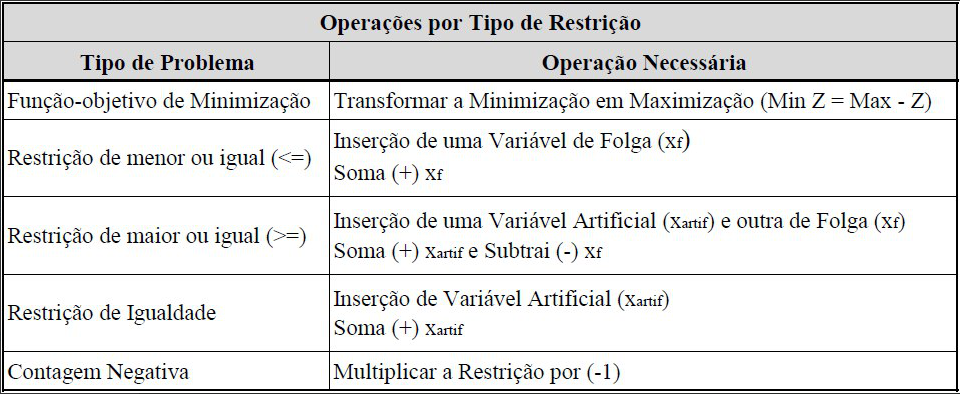

# Simplex :rocket:

Este é um método utilizado para a realização de otimizações. A tabela representada abaixo ajuda a entender quando utilizar certos tipos de variáveis.

Os passos descritos aqui, servem como auxílio para os alunos da Maria Suelena, 5° ADS, Fatec SJC, caso contrário pode haver dificuldades no entendimento dos passos. Porém caso queira entender as dicas abaixo, recomenda-se o livro `Pesquisa Operacional na tomada de decisão`.

## Simplex sem variáveis artificiais

Este é um tipo de problema, é identificado quando as restrições do exercício, são todas `<=`, assim como descrito na tabela assim.

Os passos para a solução deste tipo de problema são os seguintes:

- 1 Forma padrão
  - 1.1. Passar todas as inequações para equações;
  - 1.2. Caso o exercício seja de minimização, pode-se multiplicar a Função objetivo por `-1` (Isto facilita o processo).
- 2 Construir a tabela simplex;
  - 2.1. Pegar todos os valores presentes nas equações geradas no passo anterior, e colocar em uma matriz
  - 2.2. `Sobre a base`: A matriz funciona através de uma base, lembre-se que, para entrar na base, deve-se verificar qual coluna tem o valor `1` nas variáveis auxiliares da linha que está sendo montada.
- 3  Realizar as iterações
  - 3.1. Definição do pivô: Aqui é necessário realizar a busca pela coluna da Função objetivo que contenha o maior valor, após isto, busque nesta coluna, o valor que ao dividir o RHS, tem o menor valor (`Cuidado, os valores não podem ser menores ou iguais a zero`).
  - 3.2. Após a definição do pivô, crie uma nova tabela, substituindo primeiro a base, nesta será necessário substituir primeiro a linha onde estava o pivô pela coluna onde ele estava (Somente o nome), para preencher esta linha deve-se dividir todos os valores da linha que foi subtituida pela linha do pivô dividida por ele mesmo.
  - 3.3. Agora, será necessário fazer com que, a coluna onde estava o pivô na tabela anterior, fique com todos os valores zero e apenas o próprio pivô com valor um (Isto por conta de você ter passado todos os valores da linha do pivô divididos por ele mesmo), para fazer isto, multiplique a linha do pivô da nova matriz, por um valor que, ao somar o resultado desta, nas outras linhas, na mesma coluna onde está o pivô, o resultado seja zero. Repita isto para todas as linhas.
  - 3.4. Por fim, verifique se após realizar o passo `2.3` na linha da função objetivo, os valores desta linha são iguais ou menores que zero, caso não, repita todo o processo de iteração sobre esta tabela que foi gerada.

## Simplex com variáveis artificiais

Os mesmos passos desenvolvidos no simplex sem variáveis artificiais, serão repetidos aqui, porém, serão acrescentados variáveis artificiais na equação da forma normal, e as variáveis auxiliares deverão ser passadas subtraindo os valores das equações onde elas são inseridas.

## Exercícios :boom:

Os exercícios resolvidos, estão no diretório `src`, e são separados pelos seguintes tipos:
- Sem variáveis artificiais (sem_artificiais);
- Com variáveis artificiais (com_artificiais);

Há também exercícios resolvidos pelo [@kyassunaga](https://github.com/kyassunaga)

Todos eles são resolvidos utilizando Javascript, assim, eles devem ser utilizados como guia para sua solução.

## Sobre

Estas são anotações que fiz nas aulas, caso não tenha entendido, podemos discutir para melhorar cada um dos passos que descrevi acima :airplane:
